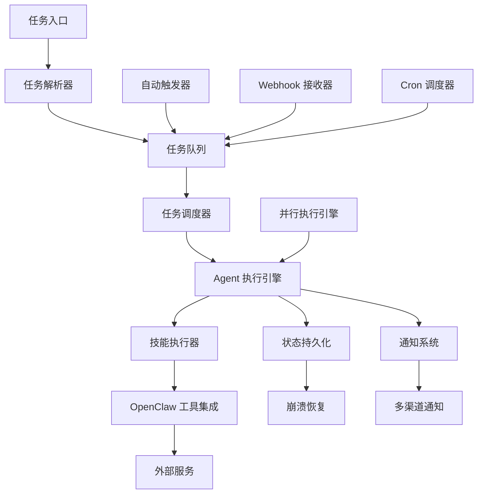

# AgentWork 项目优化方案

## 需求概述

AgentWork 项目旨在实现"一人公司"自动化，让 AI Agent 能够真正自动执行任务。当前项目已具备基础架构（工作流引擎、技能系统、任务编排器等），但存在关键功能缺失，无法实现真正的自动化执行。

### 当前状态分析

**已有能力：**
- 工作流引擎（DAG 执行、检查点）
- 技能系统（10个技能：article-writing, web-search, boss-resume 等）
- 任务编排器（拆解、执行）
- 前端（Vite，运行在 5173）
- 数据库（SQLite）

**关键差距：**
1. **Agent 真正执行能力** - `executeSkill()` 只返回模拟数据
2. **自动触发调度器** - triggers 定义了但未实现
3. **任务入口** - 缺少聊天入口和自然语言解析
4. **并行执行** - 步骤只能串行执行
5. **通知系统** - 任务完成/失败无通知
6. **任务队列** - 无排队和优先级调度
7. **崩溃恢复** - 中断后无法继续执行

## 架构设计

### 整体架构图



### 核心组件说明

1. **任务入口层**：支持多种输入方式（聊天机器人、API、Web UI）
2. **任务解析层**：自然语言理解，任务意图识别
3. **任务队列层**：优先级队列，任务调度
4. **执行引擎层**：真正的 Agent 执行，与 OpenClaw sessions_spawn 集成
5. **技能执行层**：调用实际的 AI Provider 和工具
6. **状态管理层**：持久化状态，支持断点续跑
7. **通知层**：多渠道任务状态通知

## 模块拆分

### 新增模块

#### 1. Agent 执行引擎 (`src/agent-engine/`)
- **AgentRunner**: 真正的 Agent 执行器，调用 OpenClaw sessions_spawn
- **AIProviderManager**: 管理不同的 AI Provider（Qwen、OpenAI、Claude等）
- **ToolExecutor**: 执行具体的工具调用

#### 2. 自动触发器 (`src/triggers/`)
- **CronScheduler**: 基于 cron 的定时任务调度
- **WebhookReceiver**: Webhook 接收和处理
- **TriggerManager**: 统一管理所有触发器

#### 3. 任务入口 (`src/entrypoints/`)
- **ChatBotIntegration**: QQ/微信/Telegram bot 集成
- **NaturalLanguageParser**: 自然语言任务解析
- **APIGateway**: REST API 入口

#### 4. 并行执行引擎 (`src/parallel-executor/`)
- **DependencyAnalyzer**: 分析步骤依赖关系
- **ParallelTaskRunner**: 并行执行无依赖步骤
- **ExecutionCoordinator**: 协调并行和串行执行

#### 5. 通知系统 (`src/notifications/`)
- **NotificationManager**: 统一通知管理
- **ChannelAdapters**: 多渠道适配器（QQ、微信、邮件等）
- **TemplateEngine**: 通知模板引擎

#### 6. 任务队列 (`src/task-queue/`)
- **PriorityQueue**: 优先级任务队列
- **QueueManager**: 队列管理器
- **Scheduler**: 任务调度器

#### 7. 崩溃恢复 (`src/recovery/`)
- **StatePersister**: 状态持久化
- **RecoveryManager**: 崩溃恢复管理
- **CheckpointRestorer**: 检查点恢复

### 修改模块

#### 1. 任务编排器 (`src/orchestrator/`)
- 修改 `executeSteps` 方法，集成新的 Agent 执行引擎
- 添加并行执行支持
- 集成通知系统

#### 2. 工作流引擎 (`src/workflow/`)
- 修改 `executeStep` 方法，使用真正的技能执行
- 增强检查点机制
- 支持并行步骤执行

#### 3. 技能注册中心 (`src/skills/`)
- 增强技能加载机制
- 支持动态技能注册

#### 4. 数据库 (`src/db/`)
- 添加任务队列表
- 增强状态持久化表结构
- 添加通知配置表

## 技术选型

### 核心技术栈

| 功能 | 技术选型 | 理由 |
|------|----------|------|
| 任务队列 | BullMQ + Redis | 成熟的 Node.js 任务队列，支持优先级、延迟、重试 |
| Cron 调度 | node-cron | 轻量级 cron 实现，易于集成 |
| Webhook 接收 | Express.js | 轻量级 Web 框架，适合 API 服务 |
| 并行执行 | Promise.all + Worker Threads | 原生 Node.js 支持，并发性能好 |
| 状态持久化 | SQLite + WAL 模式 | 保持现有数据库，启用 WAL 提升并发性能 |
| 通知系统 | OpenClaw message 工具 | 直接使用 OpenClaw 现有通知能力 |
| Agent 执行 | OpenClaw sessions_spawn | 直接集成 OpenClaw 的子代理机制 |

### 具体实现方案

#### 1. Agent 真正执行能力
- **方案**: 使用 OpenClaw 的 `sessions_spawn` 工具创建子代理
- **实现**: 
  ```typescript
  // 在 AgentRunner 中
  async executeSkill(skill: Skill, input: any): Promise<any> {
    const session = await sessions_spawn({
      prompt: `执行技能 ${skill.manifest.name}，输入: ${JSON.stringify(input)}`,
      tools: ['read', 'write', 'exec', 'web_search', ...skill.manifest.requires || []],
      model: this.config.model
    });
    return session.result;
  }
  ```

#### 2. 自动触发调度器
- **Cron 调度器**: 使用 `node-cron` 解析 workflow triggers 中的 cron 表达式
- **Webhook 接收器**: 使用 Express.js 创建 webhook endpoint，接收外部触发

#### 3. 任务入口
- **聊天机器人集成**: 使用 OpenClaw 的 `message` 工具监听消息
- **自然语言解析**: 使用 AI Provider 进行意图识别和参数提取

#### 4. 并行执行
- **依赖分析**: 基于拓扑排序识别无依赖步骤
- **并行执行**: 使用 `Promise.allSettled` 并行执行独立步骤

#### 5. 通知系统
- **多渠道通知**: 封装 OpenClaw 的 `message` 工具，支持不同渠道
- **事件驱动**: 基于现有事件系统触发通知

#### 6. 任务队列
- **优先级队列**: 使用 BullMQ 实现，支持 high/normal/low 优先级
- **任务调度**: 队列消费者从数据库加载任务执行

#### 7. 崩溃恢复
- **状态持久化**: 每个步骤执行前后保存状态到数据库
- **断点续跑**: 启动时检查未完成任务，从中断点继续

## 优先级排序

### P0 (必须实现)
1. **Agent 真正执行能力** - 核心功能，没有这个就不是真正的自动化
2. **任务队列** - 基础架构，支持任务管理和调度
3. **崩溃恢复** - 生产环境必需，保证任务可靠性

### P1 (重要功能)
1. **通知系统** - 用户体验关键，让用户知道任务状态
2. **并行执行** - 性能优化，提升执行效率
3. **任务入口** - 用户交互入口，支持自然语言任务下发

### P2 (增强功能)
1. **自动触发调度器** - 自动化场景支持
2. **高级监控和日志** - 运维和调试支持

## 实现路线图

### 第一阶段：核心执行能力 (1-2周)

**目标**: 实现真正的 Agent 执行能力和基础任务队列

**交付物**:
- ✅ Agent 执行引擎 (`src/agent-engine/`)
- ✅ 任务队列系统 (`src/task-queue/`)
- ✅ 修改任务编排器和工作流引擎
- ✅ 基础崩溃恢复机制

**关键里程碑**:
- 能够真正调用 AI Provider 执行技能
- 任务可以排队执行，支持优先级
- 任务中断后能够恢复执行

### 第二阶段：用户体验优化 (2-3周)

**目标**: 完善用户交互和通知体验

**交付物**:
- ✅ 通知系统 (`src/notifications/`)
- ✅ 并行执行引擎 (`src/parallel-executor/`)
- ✅ 任务入口 (`src/entrypoints/`)
- ✅ 增强的状态持久化

**关键里程碑**:
- 任务完成/失败时发送多渠道通知
- 无依赖步骤能够并行执行，提升效率
- 支持通过聊天机器人下发自然语言任务

### 第三阶段：自动化增强 (1-2周)

**目标**: 完善自动化触发和调度能力

**交付物**:
- ✅ 自动触发器 (`src/triggers/`)
- ✅ Webhook 接收器
- ✅ Cron 调度器
- ✅ 高级监控和日志

**关键里程碑**:
- 支持定时任务自动触发
- 支持外部 webhook 触发任务
- 完整的监控和调试能力

### 最终目标

实现一个完整的"一人公司"自动化平台，具备以下能力：
- 🤖 **真正的 Agent 执行**: 不再是模拟，而是真正的 AI Agent 执行
- ⚡ **高效并行**: 无依赖任务并行执行，最大化效率
- 🔔 **智能通知**: 多渠道任务状态通知
- 📅 **自动调度**: 支持定时和 webhook 自动触发
- 💪 **可靠执行**: 崩溃恢复，断点续跑
- 🗣️ **自然交互**: 支持自然语言任务下发

## 风险评估

### 技术风险
1. **OpenClaw sessions_spawn 集成复杂性**: 需要深入理解 OpenClaw 的子代理机制
   - **缓解措施**: 先实现简单的集成，逐步完善
   
2. **并行执行的状态一致性**: 并行执行可能导致状态不一致
   - **缓解措施**: 使用数据库事务和锁机制保证一致性

3. **资源消耗**: 并行执行可能消耗大量系统资源
   - **缓解措施**: 实现资源限制和队列控制

### 实施风险
1. **开发周期**: 功能较多，可能超出预期时间
   - **缓解措施**: 严格按照优先级分阶段实施

2. **向后兼容**: 修改现有架构可能影响现有功能
   - **缓解措施**: 保持接口兼容，逐步替换内部实现

## 时间估算

- **总工作量**: 6-8 周
- **第一阶段**: 1-2 周
- **第二阶段**: 2-3 周  
- **第三阶段**: 1-2 周
- **测试和优化**: 1-2 周

通过分阶段实施，可以在每个阶段都交付可用的功能，降低项目风险。